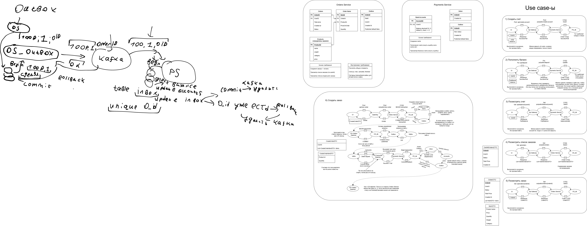

# ДЗ №3 КПО Асинхронное межсервисное взаимодействие

Автор: Плотников Владимир Денисович

Группа: БПИ 246

---

## Структура решения

- Gateway/Gateway.API - reverse proxy для микросервисов
- OrdersService
  - OrdersService.Domain - описание доменной модели и исключения
  - OrdersService.Application - UseCase-ы, интерфейсы, DTO-шки
  - OrdersService.Infrastructure - реализация репозиториев, демонов, Consumer-Producer ов для Kafka
  - OrdersService.API - api
- PaymentsService
  - PaymentsService.Domain - описание доменной модели и исключения
  - PaymentsService.Application - UseCase-ы, интерфейсы, DTO-шки
  - PaymentsService.Infrastructure - реализация репозиториев, демонов, Consumer-Producer ов для Kafka
  - PaymentsService.API - api

Применял брокер сообщений kafka, добавил kafka-ui для удобства (на порту 8090)

База данных - postgres:16

## Endpoint-ы

- GET os/orders - возвращает список всех заказов (в облегченном виде)
- GET os/orders/{orderId} - заказ со списком всех продуктов
- POST os/new-order - создать заказ (требуется добавить все товары)
- GET ps/balance/{userId} - узнать сколько денег на счете у пользователя
- PUT ps/deposit - пополнить баланс
- POST ps/create-account - создать новый счет, можно указать начальный баланс (уникальный по userId)

## Схема общения между сервисами:

Если markdown съел разрешение, то можно просто файликом посмотреть

## Docker

Почему-то иногда была проблема с kafka; Сервисы переставали подключаться. Решение (может можно как-то менее радикально конечно) - удалить контейнер docker-compose и volume для kafka (локально volume тоже почему-то падал, хотя для postgres-а сработало)

Раняться на портах:
- Gateway: http://localhost:8080/swagger
- Payments Service: http://localhost:8082/swagger
- Orders Service: http://localhost:8081/swagger
- Kafka ui: http://localhost:8090/swagger